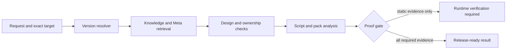
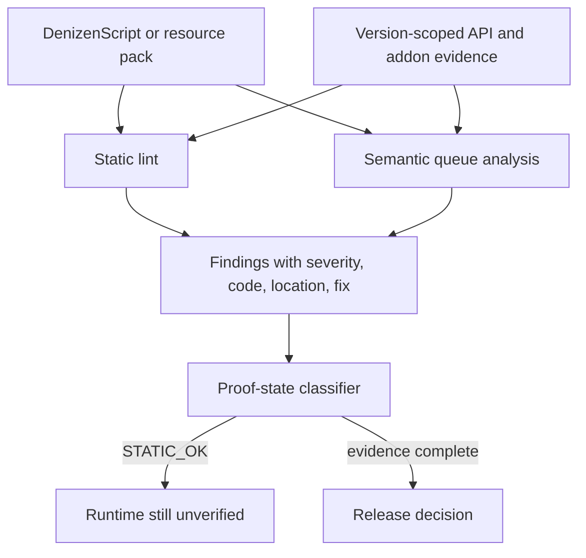
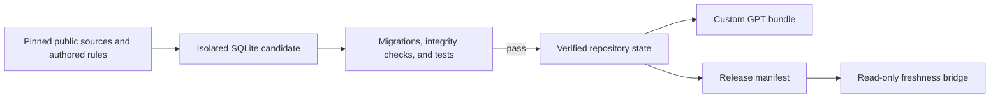

# dCore

> Version-aware engineering tools for DenizenScript, Denizen, DenizenM, addons, and Minecraft visual systems.

**dCore is development support infrastructure.** It gives people and coding agents a verifiable workflow for designing, reviewing, linting, and releasing DenizenScript projects across exact Minecraft, Paper, Denizen, DenizenM, addon, and resource-pack versions.

It combines version-pinned API knowledge, static analysis, bounded semantic execution, resource-pack graph validation, proof-state release gates, and an MCP server that brings the same tooling into Codex, Claude Code, Cursor, Zed, and other MCP clients.

> [!WARNING]
> dCore is actively under development. Rules, target coverage, lint behavior, and integrations will continue to evolve. Bug reports, target data, and proposals for improving any subsystem, including lint, are welcome. Useful contributions will be reviewed, credited, and considered for future releases through [GitHub Issues](https://github.com/28mielav/dCore/issues).

## Why dCore

Denizen projects fail at boundaries that plain text search and generic coding advice cannot prove:

- a tag exists in one target build but not another;
- a script is syntactically plausible but has unreachable commands, unsafe queue ownership, or an unbounded lifecycle;
- a resource pack links JSON, shaders, programs, and post-processing stages incorrectly;
- a route looks attractive but has no evidence for its runtime assumptions;
- an agent produces code without distinguishing static evidence from an in-game proof.

dCore turns those boundaries into explicit checks and proof states.

## Engineering model



The output is intentionally evidence-first. A successful static result is not presented as a successful Minecraft runtime result.

## Core systems

### Version registry and Meta overlays
Resolves exact Denizen, DenizenM, Minecraft, Paper, Java, and addon targets without borrowing current API facts for historical builds.

### DenizenScript lint
Finds terminal-command reachability problems, event blast radius, ceremonial forwarding tasks, type and tag mistakes, deprecated mechanisms, and Reflect proof boundaries.

### Semantic-lite executor
Builds a source-derived model of containers, scopes, queues, contexts, `if`, `choose`, `repeat`, `while`, `stop`, `run`, `inject`, and wait boundaries without claiming to run Bukkit.

### Resource-pack lint
Validates a merged directory or ZIP across JSON, `#moj_import`, namespaces, program and stage linkage, paths, channels, post targets, and shader ownership.

### Design and release gates
Compares genuinely different routes, records ownership and cost assumptions, and prevents static confidence from being promoted to runtime proof.

### MCP server
Exposes the exact CLI behavior over stdio JSON-RPC for coding agents and IDEs.

## Analysis pipeline



### Proof states

| State | Meaning |
|---|---|
| `STATIC_OK` | Static structure and configured checks passed. Runtime behavior is still unverified. |
| `RUNTIME_UNVERIFIED` | The exact client, server, addon JAR, graphics mode, or fixture is needed before a runtime claim. |
| `DECISION_REPRODUCED` | A route decision was recomputed from the supplied evidence. It is not a runtime success claim. |
| `RELEASE_BLOCKED` | Required target, retrieval, static, addon/JAR, or runtime evidence is missing or failing. |

## Install

Requires Python 3.12 or newer.

```bash
python -m pip install -e .
```

For development and the full test suite:

```bash
python -m pip install -e ".[dev,mcp]"
python -m pytest -q
```

## CLI

```bash
# Discover available commands
dcore --help

# Lint a script against an exact target
dcore lint --help

# Lint a merged resource pack or shader pipeline
dcore lint-pack --help

# Retrieve version-scoped engineering guidance
dcore retrieve --help

# Compare meaningful implementation routes
dcore design --help

# Run target, static, addon, and runtime proof gates
dcore run --help

# Inspect available version artifacts
dcore versions --help
```

Every command exposes its own `--help`, so flags remain local to the subsystem that owns them.

## MCP for coding agents

dCore is usable as a local stdio MCP server with no runtime dependency beyond Python and the package itself.

```bash
python -m dcore.mcp.server --describe
python -m dcore.mcp.server
```

Example client configuration:

```json
{
  "mcpServers": {
    "dcore": {
      "command": "python",
      "args": ["-m", "dcore.mcp.server"],
      "cwd": "/absolute/path/to/dcore/repository"
    }
  }
}
```

The server exposes lint, resource-pack lint, retrieval, route comparison, version discovery, bounded session simulation, and release-gate tools. See [docs/MCP.md](docs/MCP.md) for the complete tool surface and client notes.

## Architecture



The database is the canonical retrieval index. GitHub Actions refreshes a build copy, applies deterministic migrations, validates the candidate, and only then promotes a passing result. A failed import or test never replaces the last known-good database.

## Repository layout

```text
dcore/                      Installable package and CLI
  knowledge/                Retrieval, target registry, SQLite access
  lint/                     DenizenScript and resource-pack analysis
  semantics/                Source-derived bounded semantic execution
  design/                   Route comparison and decision evidence
  gates/                    Proof-state and release gates
  mcp/                      Stdio MCP server and tool surface
  release/                  Manifest, bundle, update, and verification flows
knowledge/                  Canonical database, manifest, and source registry
tests/                      Unit, retrieval, MCP, and acceptance coverage
docs/                       Architecture, MCP, and operating procedures
services/update-bridge/     Read-only manifest freshness API
integrations/custom-gpt/    Custom GPT OpenAPI schema
```

## Verification and release work

```bash
# Exercise the MCP acceptance scenarios
python -m dcore.acceptance.agent --db knowledge/dcore.sqlite

# Build the standalone Custom GPT bundle
dcore build-gpt --output dist/dCore-GPT-0.70

# Validate release identity and manifest
dcore verify --help
```

The Custom GPT bundle and MCP server are independent delivery paths that share the same verified knowledge source.

## Scope and boundaries

- dCore supports engineering work around DenizenScript, Denizen, DenizenM, registered addons, and Minecraft visual systems.
- Exact compatibility claims require the relevant version and, where applicable, the installed addon JAR or real client runtime.
- Reflect syntax validity does not prove a Java signature exists for a selected build.
- Resource-pack static validity does not prove performance, F5 behavior, graphics-mode behavior, or rendering output.
- Public source material is tracked by exact commit and license policy. Reference-only sources inform facts and architecture but are not redistributed as code.

## Current release line

`0.70` introduces an MCP server for any MCP-speaking client and surfaces deprecated tags and mechanisms recorded by Meta. The Custom GPT delivery path remains available as a separately generated bundle.

## Project status

dCore is under active engineering and release maintenance. The repository includes a public OSS contract, contribution workflow, security reporting policy, changelog, and issue and pull request templates.

## Documentation

- [Architecture](docs/ARCHITECTURE.md)
- [MCP server and tools](docs/MCP.md)
- [Operations](docs/OPERATIONS.md)

## Contributing and security

Read [CONTRIBUTING.md](CONTRIBUTING.md) before proposing rules, sources, targets, or behavior changes. Use GitHub private vulnerability reporting as described in [SECURITY.md](SECURITY.md) for security issues. Release history is maintained in [CHANGELOG.md](CHANGELOG.md).

## License

dCore is licensed under the [MIT License](LICENSE). Third-party notices bundled with the semantic core remain in `dcore/semantics/core/`.
