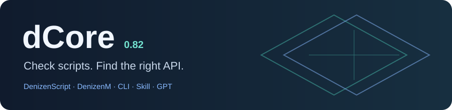

<p align="center"></p>

<p align="center">
  <a href="https://github.com/28mielav/dCore/releases/latest">Download 0.82</a> ·
  <a href="docs/OPERATIONS.md">Documentation</a> ·
  <a href="CHANGELOG.md">Changelog</a> ·
  <a href="CONTRIBUTING.md">Contributing</a>
</p>

**Check Denizen scripts, look up versioned API syntax, and catch resource-pack mistakes before testing in Minecraft.**

dCore is a Python toolkit for DenizenScript and DenizenM. The CLI, coding Skill and Custom GPT bundle use the same analysis engine and knowledge database. Basic analysis runs locally, without an API key or third-party Python packages.

## Download

Choose a package from the [0.82 release](https://github.com/28mielav/dCore/releases/tag/v0.82.0). Python 3.12+ is required to run the CLI or Skill.

| Package | Use it for | Getting started |
| :--- | :--- | :--- |
| [CLI](https://github.com/28mielav/dCore/releases/download/v0.82.0/dcore-cli-0.82.zip) | Terminal commands and automation | Extract; run `python dcore-cli/dcore.py --help` |
| [Skill](https://github.com/28mielav/dCore/releases/download/v0.82.0/dcore-skill-0.82.zip) | Coding agents and editors | Install the complete extracted `dcore/` folder in your agent's skills directory |
| [Custom GPT](https://github.com/28mielav/dCore/releases/download/v0.82.0/dcore-gpt-0.82.zip) | Analysis of uploaded projects | Follow the [GPT setup guide](gpt/BUILD.md); enable Code Interpreter & Data Analysis |

Keep each extracted package together: the runtime and database are included. Release assets also include SHA-256 checksums.

## Quick start

From the extracted CLI package:

```bash
python dcore-cli/dcore.py lint ./scripts --allow-unpinned
python dcore-cli/dcore.py retrieve --meta-query flag
python dcore-cli/dcore.py lint-pack ./resource-pack --minecraft 1.21.11
python dcore-cli/dcore.py versions --minecraft-profiles
```

`--allow-unpinned` is useful for a first scan. For version-sensitive checks, select the Minecraft and Denizen or DenizenM build you actually use. Save repeated options in `dcore.toml` beside your project:

```toml
[target]
minecraft = "1.21.8"
denizenm = "7302M"
pack_format = 64
graphics_mode = "fancy"
renderer = "vanilla"
```

Command-line options override this file. Add `--json` to lint commands for machine-readable output.

## What it checks

| Area | Checks and tools |
| :--- | :--- |
| Scripts | Command syntax, event scope, cancellation guards, queue lifetime and loop behavior |
| API lookup | Denizen, DenizenM and indexed addon sources selected for the requested version |
| Code cards | Examples selected by target, including historical `duration:` and newer `expire:` flag syntax |
| Resource packs | Metadata, active overlays, shader stages, post-processing graphs and missing references |
| Visual scripts | Display-entity availability, camera-follow patterns and attachment assumptions |
| Project review | Route comparisons, source references and explicit gaps in available evidence |

For example, cancelling every entity click after reading a player flag does not establish ownership of the clicked entity. dCore reports `broad_cancel_without_identity_guard` when it finds a reachable cancellation without a recognized context-object filter. Comments cannot satisfy that check. [Regression examples](verification/test_flow_regressions.py).

## Minecraft and plugin versions

dCore targets **Minecraft 1.16.5 through the latest version supported by Denizen**. The 0.82 bundle contains interface inventories for **34 stable Minecraft clients through 26.2**. **1.21.11 and 1.21.8 are the priority targets.**

| Coverage in 0.82 | Details |
| :--- | :--- |
| Minecraft 1.16.5–1.21.1 | Legacy post-processing interfaces, with exact per-client inventories |
| Minecraft 1.21.2–1.21.8 | Program references, direct shader stages and uniform-block changes selected by version |
| Minecraft 1.21.9–26.2 | Fullscreen vertex-ID interfaces and modern pack metadata |
| Historical Denizen | Indexed source profiles for `1.1.4-source-7f9353e83`, `1.2.6-b1782` and `1.3.0-b1804` |
| DenizenM and addons | Bundled source snapshots and explicit target selection; see [coverage and provenance](dcore/knowledge/guides/historical-targets.md) |

Shader interface coverage does not certify every plugin/server combination. Unknown targets and uncertain historical dependencies remain visible in the results. Run `versions --minecraft-profiles` for the complete offline list and client hashes.

## Visual development

The [visual workbench](dcore/knowledge/guides/visual-workbench.md) covers activation, masks, scene composition, culling, cleanup and performance. Three [1.21.8 examples](dcore/examples/visual) illustrate outline masks, scene blur and menu-background blur. Their source interfaces and static structure are checked; client rendering and GPU compilation remain unverified.

## Build from source

```bash
git clone https://github.com/28mielav/dCore.git
cd dCore
python -m pip install -e ".[dev,obfuscation]"
python -m pytest -q
python -m dcore.cli verify --root . --output dcore/knowledge/data/manifest.json
python -m dcore.cli build-cli --root . --output build/dcore-cli
python -m dcore.cli build-skill --root . --output build/dcore-skill.zip
python -m dcore.cli build-gpt --root . --output build/dcore-gpt
```

The `obfuscation` extra installs cryptography for encrypted script packing. Basic lint and lookup do not need it. Delivery tests execute the CLI, installed Skill and GPT bootstrap outside the checkout and compare their results.

| Repository directory | Contents |
| :--- | :--- |
| `dcore/` | Shared engine, knowledge database, guides and examples |
| `skill/` | Agent instructions, launcher and editor adapters |
| `gpt/` | GPT instructions and upload bootstrap |
| `verification/` | Tests and regression fixtures |
| `docs/` | Architecture, operations and release audit |
| `build/` | Generated packages; excluded from Git |

A clean static report does not mean Paper or Minecraft ran the project. Dynamic behavior, custom renderers and hosted GPT upload behavior need their own tests. [0.82 audit and known limits](docs/AUDIT-0.82.md).

## Contribute

Bug reports are most useful with a small reproducer, exact versions and the result you observed. See [CONTRIBUTING.md](CONTRIBUTING.md) for local checks and change guidelines. Report security issues through [private vulnerability reporting](https://github.com/28mielav/dCore/security/advisories/new), as described in [SECURITY.md](SECURITY.md).

The public code, Skill, GPT instructions and original examples are [MIT licensed](LICENSE). Third-party material keeps its own license and attribution. The [name and brand policy](TRADEMARKS.md) is separate.
