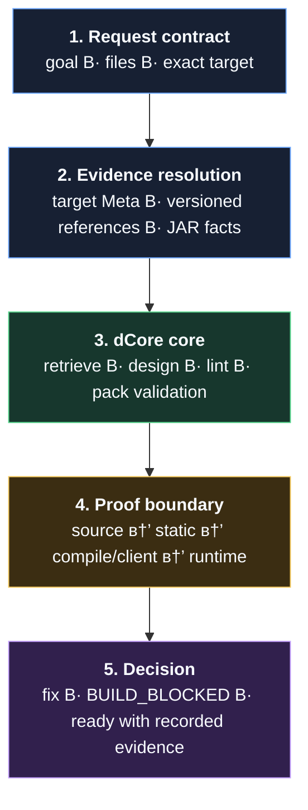
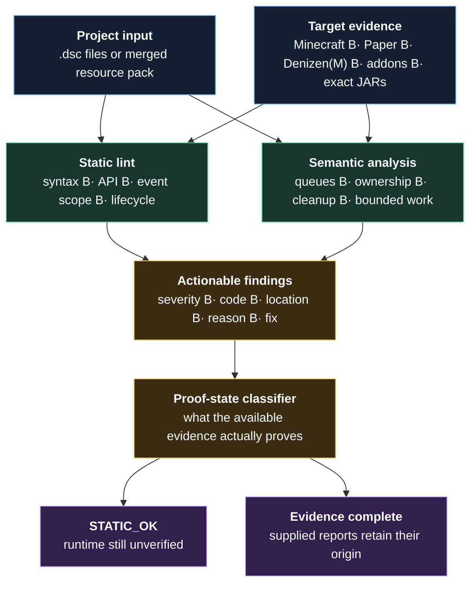

# Architecture

## Canonical delivery

`skill/dcore/SKILL.md` is the portable entrypoint. Shared guides under `dcore/knowledge/guides/` contain detailed knowledge and route-specific procedures. IDE files are deliberately thin adapters; they do not fork the knowledge base.

The model is deliberately linear: target facts enter before analysis, and every
claim leaves with its proof state. This keeps the overview readable on one
screen while preserving the important boundary.

## Analysis pipeline

## Local deterministic core

The Python package provides retrieval, Denizen lint, semantic/queue analysis, resource-pack graph validation, design comparison, proof gates, deterministic build generation, and build verification. The SQLite database is a target-scoped retrieval index. The core has no MCP server, hosted bridge, or vendor-specific implementation.

## Evidence boundary

`SOURCE_EVIDENCE`, `STATIC_OK`, `COMPILE_OK`, `CLIENT_LOG_OK`, and `RUNTIME_OK` are separate records. The build manifest inventories portable artifacts and knowledge inputs. A statically valid pack cannot be described as working runtime proof without client evidence.

## Shader profiles

Minecraft shader behavior is modeled by exact client and resource-pack format. The 1.21.x profile is separate and never inherits an activation route from another target.

## 0.82 frontend boundary

The source IR preserves commands, arguments, sections, references and spans. New event-filter and loop-path queries consume that IR. The legacy lint frontend and Denizen-Core semantic subset still have separate structural parsing; they have not been deleted or declared equivalent. Regression comparisons cover the transferred checks. Full control-flow/dataflow unification, dynamic callbacks and all Reflect extensions remain incremental work.
